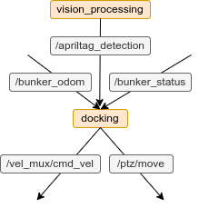

# Autonomous Docking
This packge provides auto-docking ability to any differential drive robot with a camera that could precisely spin horizontally to any degree. The system uses vision with AprilTag to locate the position and orientation of the wireless charging staton in the 3D space. Since the system uses vision to localize, the size of the tag is going to afffect the effective range of the system. It will fail at long range as the target when the target is too small. During development, the system is tested to work in 3m radius range from the charging station with tag size of 16.9cm, as attached in [doc/36h11_0.jpg](doc/36h11_0.jpeg). To increase the effective radius, increase the size of the tag. Control signals are published using ROS to motor drivers since the rest of the robot at development uses ROS. However, no ROS packages are used in the docking system, meaning it is easily adaptable to other communication protocols (ie: mqtt) with a slight modification to the publisher/subscriber related lines in the code.

https://user-images.githubusercontent.com/44683126/186012292-9144e186-d740-4d32-9c4c-b042317393f6.mp4

The system accuracy is tested to be 95% within the 3m range, with tag size 16.9cm \


# Requirements
  - Effective range of the system is 3m from the charging station. This is tested with a 16.9cm tag, changing the size of the tag will change the effective range of the system.
  - [Distance Offset Calibration](#distance-offset-calibration) is **required** everytime charging station is moved to a new ground level. It is preffered to have flat and leveled surface when docking.
  - Tag must be visible when robot is docked, if camera cannot see the tag after docking, adjust tag position, see more in [Debugging and Testing](#debugging-and-testing).
  - Tag must be vertical to the ground (no tilting forward/backward), tag could be rotated but preferably it is parallel to the charging station.
  - Make sure there is only one tag in vision while docking (make a list message around TagInfo.msg to include multiple tag detection).
  - Avoid strong light shinning on the tag, it may affect detection accuracy.

# Setup
## OpenCV
https://docs.opencv.org/4.x/d2/de6/tutorial_py_setup_in_ubuntu.html

Build OpeCV from source to get GStreamer support
```
sudo apt-get install cmake
sudo apt-get install gcc g++

# to support python2
sudo apt-get install python-dev python-numpy

# to support python3
sudo apt-get install python3-dev python3-numpy

# GTK support for GUI features, Camera support (v4l), Media Support (ffmpeg, gstreamer), etc.
sudo apt-get install libavcodec-dev libavformat-dev libswscale-dev
sudo apt-get install libgstreamer-plugins-base1.0-dev libgstreamer1.0-dev

# to support gtk2
sudo apt-get install libgtk2.0-dev

# to support gtk3
sudo apt-get install libgtk-3-dev

# optional dependencies
sudo apt-get install libpng-dev
sudo apt-get install libjpeg-dev
sudo apt-get install libopenexr-dev
sudo apt-get install libtiff-dev
sudo apt-get install libwebp-dev
sudo apt-get install libjasper-dev
```

Download OpenCV source code
```
git clone https://github.com/opencv/opencv.git
```

Configure and install CV
```
cd opencv
mkdir build
cd build

# configure build & install parameters
cmake ../

# build the files
make

# install to system
sudo make install
```

These lines should show up in CMake output, indicate installation path of CV. Make sure to include this in python path so cv2 could be imported properly.
```
Python 2:
  Interpreter:                 /usr/bin/python2.7 (ver 2.7.18)
  Libraries:                   /usr/lib/x86_64-linux-gnu/libpython2.7.so (ver 2.7.18)
  numpy:                       /usr/lib/python2.7/dist-packages/numpy/core/include (ver 1.16.5)
  install path:                lib/python2.7/dist-packages/cv2/python-2.7

Python 3:
  Interpreter:                 /usr/bin/python3 (ver 3.8.10)
  Libraries:                   /usr/lib/x86_64-linux-gnu/libpython3.8.so (ver 3.8.10)
  numpy:                       /usr/lib/python3/dist-packages/numpy/core/include (ver 1.17.4)
  install path:                lib/python3.8/site-packages/cv2/python-3.8
```

## Camera Calibration (monocular camera)
http://wiki.ros.org/camera_calibration/Tutorials/MonocularCalibration

Print checkerboard at https://markhedleyjones.com/projects/calibration-checkerboard-collection \
Select checkboard with size A1 and larger to get better accuracy, sample checkerboard is at [doc/A1-80mm-9x6.pdf](doc/A1-80mm-9x6.pdf)

Install rosdep
```
# ROS Noetic
sudo apt-get install python3-rosdep

# ROS Melodic and earlier
sudo apt-get install python-rosdep
```

Install camera_calibration package
```
rosdep install camera_calibration
```

Run streaming and calibration nodes
  - `--size` refers to the number of internal corner, as described in the OpenCV documentation (i.e. the 9x6 checkerboard contains 10x7 squares, as shown in sample)
  - `--square` refers to the side length of squares measuered in meters
```
# terminal 1
roscore

# terminal 2, check source code to select desired streaming pipeline
cd src
python3 calibration_stream.py

# terminal 3, MUST update parameters
# only source ros, don't source ws. MUST run with a monitor
source /opt/ros/noetic/setup.bash
rosrun camera_calibration cameracalibrator.py --size 8x6 --square 0.108
```

After calibration is done, obtain the result
```
cd src/resources
mkdir tmp
mv /tmp/calibrationdata.tar.gz tmp
tar -xvf tmp/calibrationdata.tar.gz -C tmp
mv tmp/ost.yaml ptz_calibration.yaml
rm -r tmp
```

## AprilTag
https://github.com/AprilRobotics/apriltag \
https://github.com/duckietown/lib-dt-apriltags

Use 36h11 tag family for detection, id:0 example at [doc/36h11_0.jpeg](doc/36h11_0.jpeg)

Install python binding (by DuckyTown) of the originial AprilTag library written in c (by APRIL robotics lab)
```
pip3 install dt-apriltags
```

Alternatively, you could build AprilTag library from source
```
git clone https://github.com/AprilRobotics/apriltag.git
cd apriltag
cmake -B build -DCMAKE_BUILD_TYPE=Release
cmake --build build --target install
sudo ldconfig
```

If the tag used has different size than 16.9cm, its new dimension should also be updated in [src/no_buffer_tag_detect_oop.py](src/no_buffer_tag_detect_oop.py).
```
self.tag_size = 0.169
```

## Launch
```
# terminal 1
# launch other nodes in the robot

# terminal 2
# start april tag detection, must run from src/ to load calibration files with relative path
cd src
python3 no_buffer_tag_detect_oop.py

# terminal 3
# start docking 
cd src
python3 docking_oop
```

## Distance Offset Calibration
Tag must be in vision at all time during phase 3, if not the docking system will abort. So if optical camera is placed to the right side of the robot when backing up, tag should also be placed on the left side of the charging station, and vice versa. If tag is not visible when robot is close to statin, change the positioning of the tag, do not tilt the camera. This means the relative position of the tag to the station could vary between different setups. Thus testing is needed to calibrate the distance parameters.

In `__init__()` in docking_oop.py, you should find

```
# distance constants in phase 2
self.p2_y_first = -0.11
self.p2_y_second = 0.21

# distance constants in phase 3
self.p3_stop_x = 0.765
```

`p2_y_first`, `p2_y_second` are the y axis (left/right) offset in phase 2 for first and second alignment respectively. They are used to make the robot line up with the charging station at the end of phase 2. Follow the diagram below to tune the y offset. It is recommended to start tuning with both offsets set to 0, then use binary search approach to obtain desired value for the system.\


`p3_stop_x` is the x value from tag detection when robot is charging. It is used to stop robot from running into the charging station. Decrease to make robot come closer to the charging station, increase the value to stop robot further away from the station.

Robot speed while docking is also configurable by changing the following lines from `__init__()` in docking_oop.py
```
self.spin_left = 1
self.spin_right = -1
self.spin_slow = 0.04
self.spin_fast = 0.2
self.forward = 1
self.backward = -1
self.straight_slow = 0.04
self.straight_med = 0.2
self.straight_fast = 0.3
```

# System Overview
## AprilTag Detection Result
After providing calibration data, tag size and tag family, the system will be able to detect 3D pose of the tag, including orientation (roll, pitch, yaw) and position (x, y, z) data with camera as the origin. However, not all data are used in the system, for orientation, only yaw (also refered to as alpha in the code) is used, and for position, z is irrelavant since height is not used when lining up the robot. It is also worth noting that x is the depth axis (forward is positive) and y is the parallel axis (left is positive). \
Other than distance, the system also detects tag's center and corner positions in pixels. This data is currently not used in the system, but can be utilized if you want to replace phase 2 with two tags, more on this alternative approach in [Design Breakdown](#design-breakdown).

## ROS Topic Diagram
`/bunker_odom` (used for abort in phase 1 if spining too long withought seeing tag) and `/bunker_status` (used to monitor voltage change) are not part of the core docking system. Related code can be removed if they don't exist in your robot. \
`/vel_mux/cmd_vel` is used to control movement of the robot, and `/ptz/move` is used to control the camera angle. Both should be mapped to equivalent topics in your robot. \


## System Diagram


## Docking Phases
Orange arrow represent heading of the robot, black arrow represent heading of the camera.
### Phase 1


### Phase 1 second time


### Phase 2


### Phase 2.5


### Phase 3


### Phase 4


# Design Breakdown
In this section I'm going to explain my thought process in designing this system and why I didn't choose other methods that are similar.

Start with chronological order, in p1, the most important task is to make the robot parallel to the station plane, hence perpendicular to the normal line of the station plane. After getting alpha (or yaw), I didn't use odometry as angle reference when spinning the robot. This is because the odom reading in the robot I used for development has around 20-30 deg delta for every 360 revolution. Odom think it's at full revolution when robot has rotated 380-390 deg in reality. This is not accurate at all, and thus not suitable for allignment that require high precision. That is why I used camera angle as reference when spinning the robot and required precise camera angle control in Introduction. If in your system, the camera angle cannot be controlled precisely, but you have a good odometry, you could still use this docking system. However, you would need to tweak p1 before using the system.

In p2, you may have noticed y offset is different, quite signigicantly by 30cm, between first and second allignment, even though they both reach the same goal of moving the robot to normal line. This is because of the distance error in tag detection, the further away the camera is, the greater the error in distance will be. The starting position of the robot and it's distance from the station is not fixed, so y offset for the first time is likely not accurate enough to make sure robot is perfectly line up on the normal line. So I picked an offset that is good enough to get the robot relatively close to the normal line from different starting positions. I then let the robot to allign again when it is close enough at a fixed and known distance as described in [System Diagram](#system-diagram). Since the robot is now relatively close to the tag and the distance is fixed, the y offset is now going to be roughly the same regardless of its starting positions. Thus the result of second allignment is going to be much more accurate then the first time and can be guranteed that the robot is now on the normal line of the station plane after going through p2 for the second time.

There are alternative solutions to line up the robot, one of them is to have a second tag that is offset behind and above the current tag. The idea is that the center of these two tags are only in the same perpendicular line (same x coordinate in the frame) when the camera is on the normal line. If looked from left side, the taller tag is going to appear on the right side of the lower tag, and vice versa. This could be adapted if y offset is not accurate enough. This could be implemented in the system with additional mechanical work required. Line up feedback in p2 would also required some tweaking.
